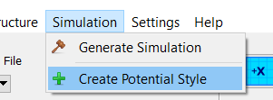
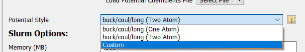
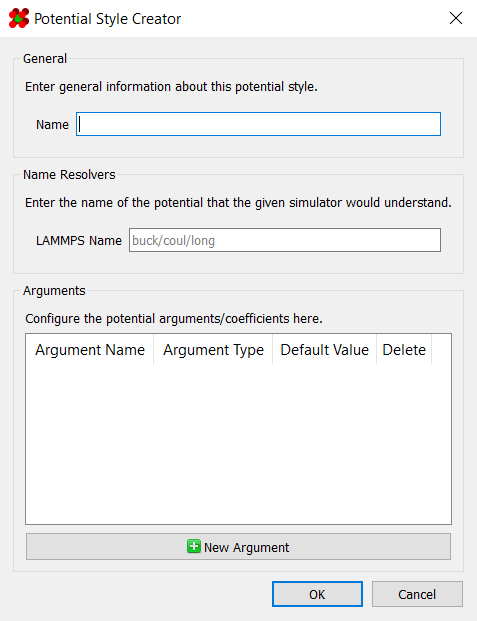
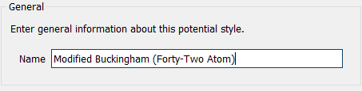
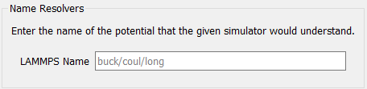
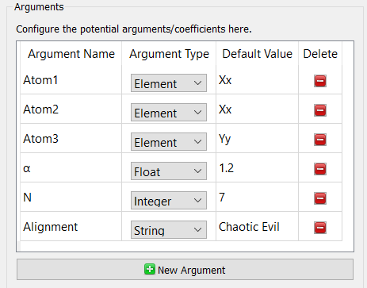
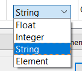

# Adding Potentials

It may come to pass that you will need a potential other than the 
Buckingham potential already included. Fortunately, this program 
includes support for creating and adding arbitrary potentials.

For this, the potential style builder can either be found under 
`Simulation > Create Potential Style`:



Or it can be found in the simulation builder dialog for any of the 
LAMMPS-based simulations:



Once launched, you will be met with a dialog for creating a new 
potential style:



## Style Builder 

The first field needed is a **name**. Note that this name is 
arbitrary, and will not be seen by any of the simulators. 
However, this will be the name referred to in 
[potential coefficient files](../Saving Potential Coefficients/#file-format).



Next, you will need to enter a name that the simulator would 
recognize. For example: `buck/coul/long` for LAMMPS. A complete 
list of LAMMPS potentials is available [here](https://docs.lammps.org/pair_style.html).



Finally, you will need to declare all arguments your potential has:



Each argument requires a **name**, **type**, and **default value**. 
Additionally, no two arguments can have the same name. The type, 
meanwhile, can either be *element*, *float*, *integer*, or 
*string*:



Finally, each argument must be given a default value with a type 
that matches the aforementioned specified type.

Once finished, click "OK," and you will be prompted to save the 
potential style. In order for this new style to be automatically 
recognized by the program, it <span style="color: red;">must</span> 
be saved to `/assets/simulation-builders/potential-defs/`.

<table id="registered-list-info" width=75% align=center class="info" style="border: 2px solid #5757E0; background-color: #E0E0FF;">
	<tr><td>
		<span style="font-weight: bold;">Note:</span> once a style is successfully created, it will automatically be added to
		the internal registered list.  However, you may need to close and reopen the 
		simulation builder dialog for it to show up in the "Potential Style" dropdown.
	</td></tr>
</table><br />

---

## File Format

Potential definitions are saved as a human-readable `.json` file. 
Here, several nested key-value pairs contain all the information 
that would've been entered above.

As an example, here is the definition for the default Buckingham 
potential:

```json
{
	"name": "buck/coul/long (Two Atom)",
	"resolutions": {
	"LAMMPS": "buck/coul/long"
	},
	"arguments": {
		"Atom1": {
			"dtype": "element",
			"default": "Xx"
		},
		"Atom2": {
			"dtype": "element",
			"default": "Xx"
		},
		"A": {
			"dtype": "element",
			"default": 0.0
		},
		"ρ": {
			"dtype": "float",
			"default": 0.01
		},
		"C": {
			"dtype": "float",
			"default": 0.0
		}
	}
}
```


