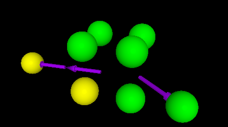
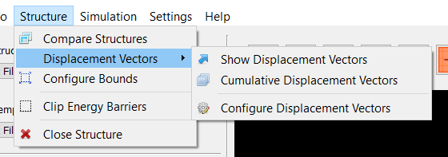
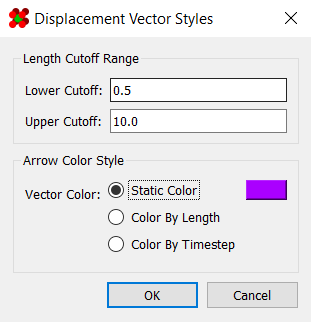
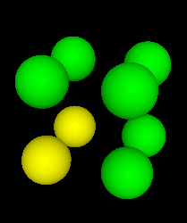
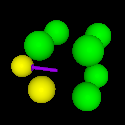
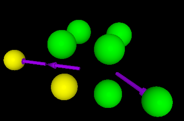
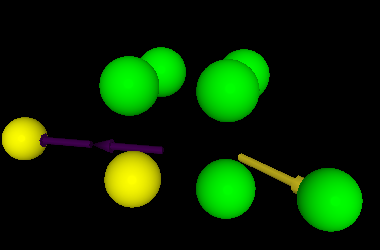
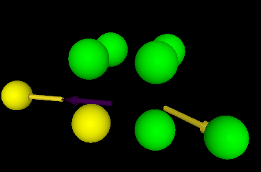

# Displacement Vectors

"Displacement vectors" allow you to compare atom positions from 
between frames on the [timeline](../Timelines/).

It should be noted that this feature is only enabled when in 
[timeline](../Timelines/) mode.

---

## Activating Displacement Vectors

Displacement vectors are enabled using the options under 
`Structure > Displacement Vectors`.

Here, you can show/hide displacement vectors using "Show 
Displacement Vectors" option. By default, this will only show 
displacements between successive frames. To show all displacements 
up to the current frame, toggle "Cumulative Displacement Vectors."

It must be noted that, for large structures with long timelines, 
calculating these displacement vectors ceases to be a real-time 
task. Although they are calculated automatically when loading a 
structure, it may take a few seconds before cumulative displacement 
vectors can appear.

Lastly, any displacement vector involving an atom that is not 
visible in the current frame will not be shown.

---

## Styling Displacement Vectors

Clicking on the "Configure Displacement Vectors" option in the 
menu bar launches a dialog containing several options for 
configuring how displacements are shown. These include setting 
range cutoffs, as well as colorization:

The **lower cutoff** and **upper cutoff** options hide any 
displacement vectors whose lengths fall outside that range.

Meanwhile, there are three options for coloring displacement 
vectors: static color, color by length, and color by timestep.

The first option, **static color**, is self-explanatory. All 
displacement vectors are rendered with the provided color:

<table align=center class="images">
	<tr>
		<td>

1.
</td>
		<td>

2.
</td>
		<td>

3.
</td>
	</tr>
</table> 

The second option, **color by length**, renders vectors according to 
their length. Their color is chosen using the viridis colormap, 
with the range chosen from the minimum and maximum lengths of all 
visible displacements.

The third option, **color by time**, renders vectors according to 
the time index at which they occurred. Their color is chosen using 
the viridis colormap, with the range chosen from the minimum and 
maximum timestep of all visible displacements.

