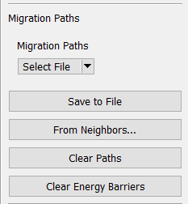
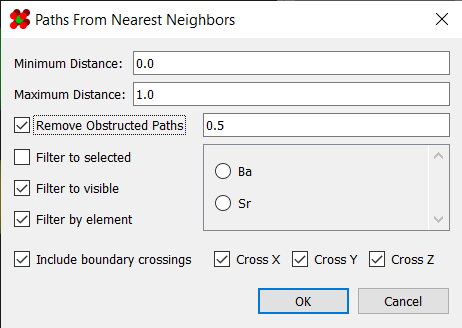
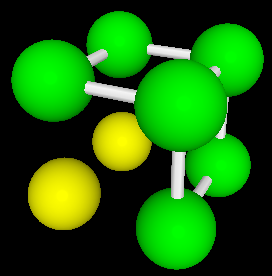
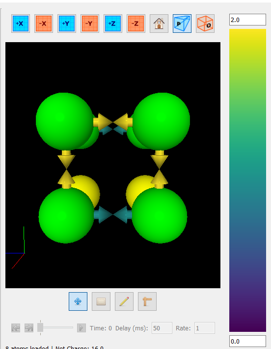
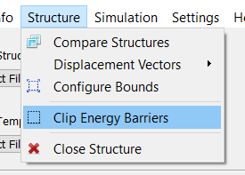

# Migration Paths

One of the primary features of this program is the ability to rapidly 
generate and view many, many migration barriers. Migration barriers are 
managed using the "Migration Paths" panel on the right side:

A description of these buttons is as follows:

| Tool                  | Description   |
| --------------------- | ------------- |
| From File             | Loads migration paths/energy barriers from a CSV file. Format is described [here](../../Basic Use/Saving and Opening Files/#migration-paths) |
| Save To File          | Saves the existing migration paths to a CSV file |
| From Neighbors        | Launches the "From Neighbors" dialog (see [below](#generating-paths)) |
| Clear Paths           | Deletes all migration paths |
| Clear Energy Barriers | Deletes all energy barriers |

---

## Generating Paths

Once opened, the "From Neighbors" dialog allows you to generate 
migration paths between adjacent atoms:

This dialog includes several options for deciding which atoms to connect 
with a path:

| Option                     | Description      |
| -------------------------- | ---------------- |
| Minimum Distance           | Minimum distance between atoms for a path to form |
| Maximum Distance           | Maximum distance between atoms for a path to form |
| Remove Obstructed Paths    | Any path with a third atom within this distance will be considered "obstructed," and consequently excluded |
| Filter To Selected         | Excludes paths leading to atoms outside the selection |
| Filter To Visible          | Excludes paths leading to invisible atoms |
| Filter By Element          | Requires that paths only connect atoms of the given element |
| Include Boundary Crossings | Whether to include paths that cross the periodic boundary |

---

## Viewing Migration Paths

Once generated, the migration paths will be visible as white 
double-arrows in the viewport:

---

## Viewing Energy Barriers

Once your energy barriers have been computed, you can load them back 
into the program to view the results. In the viewer, they are represented 
as arrows, and are colored according to the energy barrier using the 
viridis color map.

In this state, the energy scale bar will also be enabled. This allows 
you to set the energy scale in the event that your data set contains 
outliers.

Additionally, energy barriers outside the scale's range can optionally 
be hidden from view. To toggle this, simply use option under 
`Structure > Clip Energy Barriers`:

