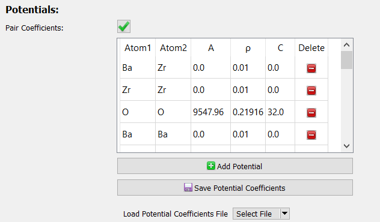

# Saving Potential Coefficients

The [simulations](../../Simulations/) offered by this generally 
require a potential coefficients to properly define interactions 
between atoms. These are set from the "Generate Simulation" dialog:



For the sake of convenience, any potential defined in the table can 
be saved to a file using the "Save Potential Coefficients" button. 
It is recommended to save such files to the 
`/assets/simulation-builders/potential-coeffs/` directory.

These can then be loaded back in later using the "Load Potential 
Coefficients File" button.

---

## File Format

Potential coefficient files are saved in the `.tsv` format. In these 
files, first line is a comment containing the name of the 
[potential style](../Adding Potentials/). The second line contains 
the column names, corresponding to parameter names in the 
aforementioned potential style. Finally, the remaining lines 
contain parameters themselves.

As an example of what a potential coefficient file looks like:

```plaintext
# buck/coul/long (Two Atom)
Atom1 Atom2 A       ρ       C
Ba	  Zr    0.00    0.01    0.00
Zr	  Zr    0.00    0.01    0.00
O	  O     9547.96 0.21916 32.00
```

In this case:

* The first line refers to a style named "buck/coul/long (Two Atom)". 
  See [Adding Potentials](../Adding Potentials/) on how to add a 
  style to the recognized list.
* The second line names where to find the parameters needed for 
  this potential. Here, it needs two atoms and three coefficients 
  (A, ρ, C).
* The third line indicates that the potential involving the 
  interaction between Ba and Zr has coefficients of 
  A=0.00, ρ=0.01, and C=0.00.
* Et cetera

<table align=center width=75% style="border: 2px solid #E05757; background-color: #FFE0E0;">
	<tr>
		<td>
			<span style="font-weight: bold;">Note:</span> If a potential coefficient file references a potential style that
			does not exist among the <a href="../Adding Potentials/#registered-list-info">registered list</a>, it will be assumed to follow 
			the currently active style.  This assumption will not always work, and 
			you will be sad.
		</td>
	</tr>
</table>
</div>

