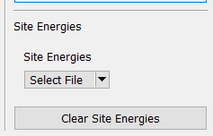
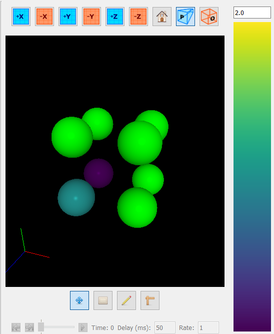

# Site Energies

This program supports coloring atoms by some energy value. This is 
especially useful for viewing the results of a 
[site minimizer](../../Simulations/Site Minimizer/) simulation. To access 
it, simply open a CSV file using the "Site Energies" pane on the right 
side:

Once opened, atoms referenced in the file will be colored by their energy 
in the viewport. They are colored with the viridis colormap, and the scale 
can be adjusted using the energy bar on the right of the viewport.

To clear site energies from the viewport, simply click the "Clear Site 
Energies" button.

A description of the expected file format for site energy files can be 
found [here](../../Basic Use/Saving and Opening Files/#site-energies).
