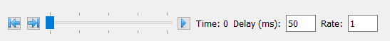
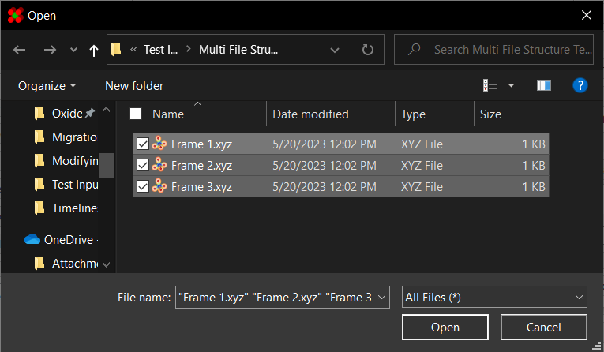
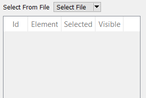
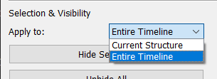

# Timelines

This program supports loading a "timeline" of structures at once. 
In this mode, the timeline bar will be available to play the structure's 
history:



Here, there are a handful of options for adjusting the history playback:

| Tool            | Description                                           |
| --------------- | ----------------------------------------------------- |
| Jump To Start   | Jumps to the start of the timeline                    |
| Jump To End     | Jumps to the end of the timeline                      |
| Timeline Slider | Displays and sets current position in timeline        |
| Play/Pause      | Starts/stops the history playback                     |
| Delay           | Time to wait between frames. Note this may be limited by performance |
| Rate            | Number of frames to advance at a time during playback |

---

## Opening In Timeline Mode

There are two ways to open a structure in timeline mode. The first method 
is to simply select multiple files when loading a structure from a 
file:



This will open files in the order they appear at the bottom.

The second method for opening a structure in timeline mode is 
if the file format already supports it. In particular, if multiple 
structures are concatenated together in a singular `.xyz` file, it 
will be interpreted as a timeline:

```plaintext
8
Atoms.
Ba 0.0 0.0 0.0
Ba 0.0 0.0 1.0
8
Atoms.
Ba 1.0 0.0 0.0
Ba 0.0 0.0 2.0
```

Finally, template files support timelines, and saving one will 
save the entire timeline.

---

## Other Notes

Due to the performance cost of updating the atom list table every 
time the current structure changes, it has been disabled in 
timeline mode:



Additionally, the user must choose whether changes in atom 
selections/visibility apply to just the current structure, or 
the entire timeline. This can be done using the dropdown on the 
left panel:



Finally, [displacement vectors](../Displacement Vectors/) 
are a feature exclusive to timeline mode. Briefly, they allow the 
user to track changes in atom positions over time.
