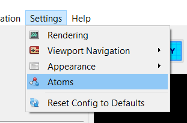
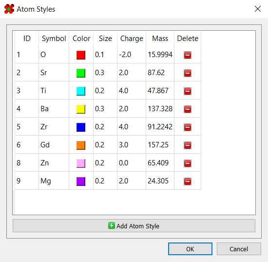

# Atom Properties

At some point, you may need to define new elements. For this, 
navigate to the "Atom Styles" dialog under `Setting > Atoms`.

This will launch a dialog for managing atomic properties:

Besides configuring the color and size of atoms, this is also where 
properties like charge, mass, and atomic symbol are defined.

To add or remove an element, simply click the "Add Atom Style" or 
"Delete" buttons respectively.
