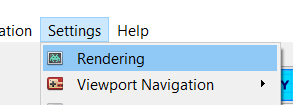
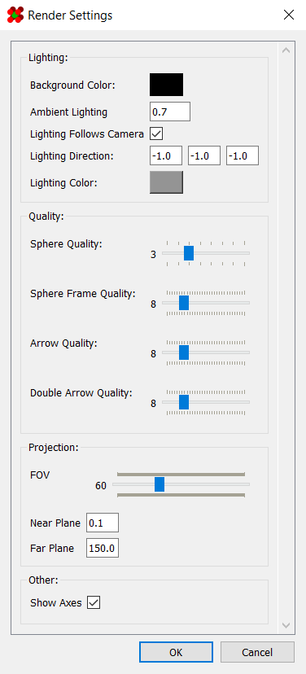

# Rendering Settings

The viewport supports some customization in its rendering. 
These settings are accessible under `Settings > Rendering`:

This launches a dialog containing a handful of configuration options:

A description of these options are as follows:

| Option                  | Description                                                       |
| ----------------------- | ----------------------------------------------------------------- |
| Background Color        | Color of the background                                           |
| Ambient lighting        | Global lighting level, ranging 0.0-1.0                            |
| Lighting Follows Camera | Forcing lighting direction to follow the camera when enabled      |
| Lighting Direction      | Direction vector for the global directional lighting              |
| Lighting Color          | Color of the light source                                         |
| Sphere Quality          | Number of subdivisions to use when generating sphere models       |
| Sphere Frame Quality    | Number of subdivisions to use when generating sphere frame models |
| Arrow Quality           | Number of subdivisions to use when generating arrow models        |
| Double Arrow Quality    | Number of subdivisions to use when generating double-arrow models |
| Show Axes               | Whether to render the coordinate axes                             |

