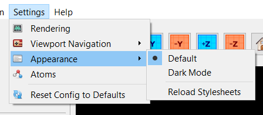

# Stylesheets

This program supports customization of the UI using `.css` 
stylesheets. To switch between stylesheets, go to 
`Settings > Appearance`.

Here, an example "dark mode" style has already been provided. 
To add new stylesheets, simply add a `.css` file to the stylesheets 
folder in `/assets/stylesheets/`. Then, either restart the program 
or click "Reload Stylesheets."

More information on using stylesheets to customize ui elements can 
be found in [Qt's documentation](https://doc.qt.io/qtforpython-6/overviews/stylesheet-examples.html).
