# Modifying Atoms

The program offers basic tools for preparing a structure for use in a simulation. 
This includes actions such as:

* [Doping atoms](#doping-atoms)
* [Creating vacancies](#mark-as-vacancy)
* [Deleting atoms](#delete-atoms)

Additionally, there are a handful of different schema for applying these modifications:

* Pick atom
* [From selected atoms](#modifying-from-selection)
* [From a random population](#modifying-a-random-population)
* [From an atom list file](#modify-from-file)

To enter modification mode, simply click the "Modify Atoms" button below the viewport. 
Alternatively, pressing any of the "Modify" buttons will automatically enter modification 
mode.

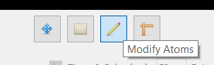

From here, you can either left-click on an atom to apply a modification, or you can use one 
of the above scheme to affect multiple atoms.

---

## Doping Atoms

The "Dope Atom" tool changes the element of the affected atoms. To pick a dopant, 
simply select from the adjacent dropdown.

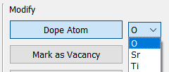 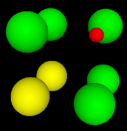

---

## Mark As Vacancy

The "Mark as Vacancy" tool will mark an atom as a vacancy without deleting it. 
This allows simulations to create vacancies at runtime using a generic structure. 
To unmark a vacancy, simple use the "Unmark Vacancy" tool.

 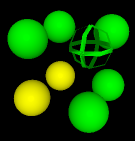

---

## Mark As Starting Vacancy

A "starting vacancy" is a special type of vacancy used by the [NEB simulator](../../Simulations/NEB/).
At runtime, the NEB simulator creates vacancies based on whichever atoms have been marked. 
Additionally, it will create a new vacancy that actually performs the jump.

However, this creates a problem: there is one more vacancy than expected. To avoid this, 
the "starting vacancy" marks the assumed starting position of the extra vacancy. 
During runtime, this starting vacancy will be overridden back into a regular atom. Thus, 
the number of actual vacancies is kept constant.

To clarify, the _"starting vacancy"_ does not mean that all jumps start here. It merely 
indicates that the vacancy supposedly originated in that position, and somehow migrated to 
wherever the current jump is taking place.

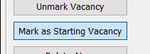 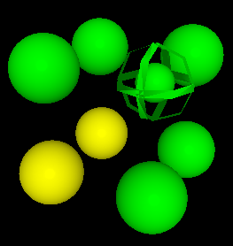

---

## Delete Atoms

The delete tool is self-explanatory: it completely destroys an atom from the structure.

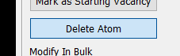 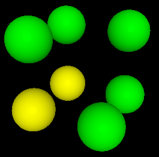

It is worth noting that atom ids are preserved when using this tool.

---

## Modifying From Selection

The "Modify Selected Atoms" tool applies the current modification to all atoms that are 
presently selected.

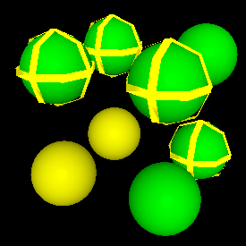 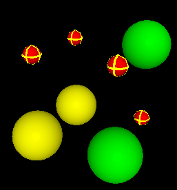

It is located with the rest of the modification tools:

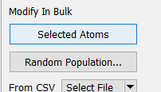

---

## Modifying a Random Population

The "Modify Random Population" tool allows you to apply modifications randomly to an 
assortment of atoms.

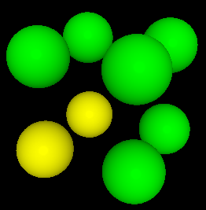 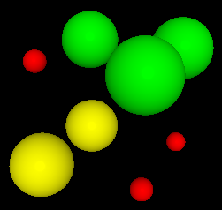

It is located with the rest of the modification tools. Clicking will launch a dialog 
containing various options for how to apply the sampling:

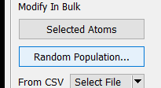 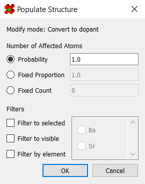

The first set of option control how the random selection is applied:

|      Mode        | Description |
| ---------------- | ----------- |
| Probability      | All affected atoms have a fixed probability of being affected |
| Fixed Proportion | A fixed fraction of the population will be chosen at random   |
| Fixed Count      | A fixed number of atoms will be chosen at random              |

  

The next set of options provide additional filters for choosing which atoms are affected:

|      Mode          | Description |
| ------------------ | ----------- |
| Filter to selected | Only selected atoms will be affected               |
| Filter to visible  | Only visible atoms will be affected                |
| Filter by element  | Only elements of the chosen types will be affected |

---

## Modify From File

A list of atom ids are loaded in from the chosen file. Any atom within this list 
will be immediately affected by the current modification.  Currently supported 
file formats are `.csv` and [GROMACS-style](https://manual.gromacs.org/archive/5.0.4/online/ndx.html) `.ndx`.

It is located with the rest of the modification tools.

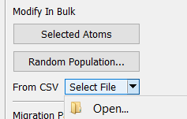
