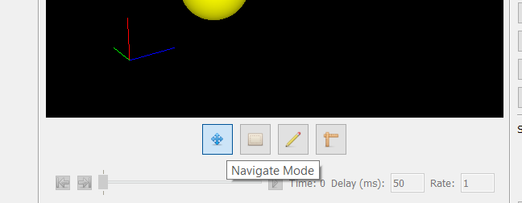
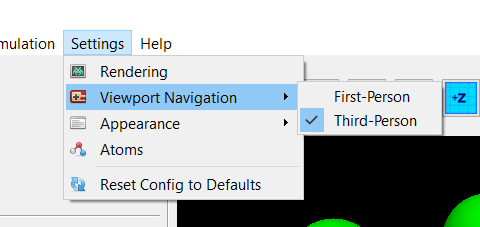
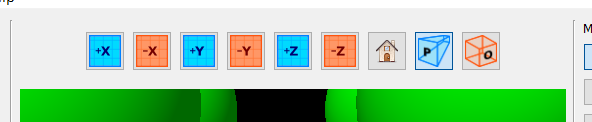
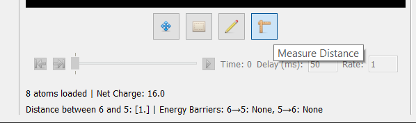

# Navigation

This program includes a 3D viewer for previewing your simulation's setup, as well as viewing 
its results. To enter _manual_ navigation mode, simply click the **"Navigate Mode"** button 
along the lower toolbar:

---

## Mouse Controls

In navigation mode, the following inputs may be used to navigate the viewport:

| Input | Action |
| ----- | ------ |
| Left-Click + Drag               | Pivot view                              |
| Middle-Click + Drag             | Translate view                          |
| Left-Click + Control Key + Drag | Alternative option for translating view |
| Mouse Wheel                     | Zoom in/out                             |

---

## First-Person Mode

Although a third-person perspective is the default, a first-person perspective has been 
included for convenience. To toggle between first-person and third-person mode, go 
to `Settings > Viewport Navigation` under the menu bar:

Under first-person mode, the controls are:

| Input | Action |
| ----- | ------ |
| Move Mouse       | Rotate view (must have the viewport in-focus) |                             |
| Left-Click       | Enter viewport focus                          |
| Escape           | Exit viewport focus                           |
| W Key            | Move forward                                  |
| A Key            | Move left                                     |
| S Key            | Move backward                                 |
| D Key            | Move right                                    |
| Space Key        | Move forward                                  |
| Shift Key        | Move down                                     |
| Hold Control Key | Move slow while holding key                   |
| Mouse Wheel      | Increase/decrease movement speed              |

---

## View Buttons

Several buttons are available above the viewport to quickly enter a 
particular view:

These buttons correspond to:

| Button | Action |
| ------ | ------ |
| +X     | Sets view so that **x-axis** points **out of** the screen |                             |
| -X     | Sets view so that **x-axis** points **in to** the screen  |
| +Y     | Sets view so that **y-axis** points **out of** the screen |                             |
| -Y     | Sets view so that **y-axis** points **in to** the screen  |
| +Z     | Sets view so that **z-axis** points **out of** the screen |                             |
| -Z     | Sets view so that **z-axis** points **in to** the screen  |
| Home   | Set to standard view                                      |
| Perspective Projection | Switch to a perspective projection        |
| Orthogonal Projection  | Switch to an orthogonal projection        |

---

## Distance Tool

A distance tool is included for convenience. To activate it, simply press 
the "Measure Distance" button below the viewport:

Then, select the pair of atoms that you wish to measure the distance 
between.
