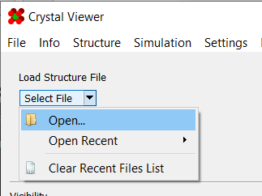

# Saving and Opening Files

There are several types of files you may need to work with when using this program. 
These include:

* [Structure Files](#structure-files)
* [Template Files](#template-files)
* [Atom Lists](#atom-lists)
* [Migration Paths](#migration-paths)
* [Site Energies](#site-energies)

---

## Structure Files

Structure files contain raw atomic data.  They may be loaded from either the menu bar or the 
"Load Structure File" box:

 

The following file formats are supported: 

| Format | Description |
| ------ | ----------- |
| .xyz        | A simple table of atomic coordinates.  More info on specification can be found [here](https://www.cgl.ucsf.edu/chimera/docs/UsersGuide/xyz.html) |
| LAMMPS .dat | Data file format used by LAMMPS.  More info on specifications can be found [here](https://docs.lammps.org/read_data.html) |
| TAD3 .dat   | Data file format used by the TAD3 simulator. |

It is worth noting that the program can import some types of information from a `.xyz` 
file's comment line (second line of the file).  Any such information is expected to take the 
format of comma-separated key: value pairs. For example:

	Foo: 10, Bar: -0.12

Currently, the only information that will be read is [bounding box](../Structures/#bounding-box) 
information. The expected format for this takes the form:
	
	xlo: -40.2, xhi: 57.5, ylo: -1.0, yhi: 53.7, zlo: -1.0, zhi: 53.7

Finally, the program supports loading multiple structures from a single `.xyz` file. When 
doing so, they will be loaded in [timeline](../../Advanced Use/Timelines/#opening-in-timeline-mode) mode. In such cases, it is expected that the 
structures are simply concatenated together in the `.xyz` file.

---

## Template Files

Template files contain the complete internal state of a structure. This includes atomic 
data, migration paths/barriers, atom selections, atom visibilities, and more. They are stored 
as gzip-compressed JSON tags of key-value pairs. They may be loaded from either the menu bar 
or the "Load Template File" box:

 

The following file formats are supported:

| Format | Description |
| ------ | ----------- |
| .gz    | gzipped-compressed JSON file |
| .json  | Uncompressed JSON file       |

---

## Atom Lists

Atom list files are used to select groups of atoms from a given list. The files are formatted 
as a list of integers corresponding to atom ids. They may be loaded from either the menu bar 
or the "Select Atoms From File" box:

 

---

## Migration Paths

Migration path files describe possible jumps between pairs of atoms. They can be saved and 
loaded from the "Migration Paths" panel:

 

Migration path files are formatted as `.csv` files, and contain two or three columns:

| Field | Description |
| ----- | ----------- |
| First                   | ID of moving atom      |
| Second                  | Uncompressed JSON file |
| Boundary Crossing Flags | Optional. See below.   |

The boundary flags, if provided, describe what periodic boundaries a path crosses. 
They are represented as a base-10 version of a binary number. Each bit in the binary 
representation corresponds to a boundary that the path crosses.

<table align=center class="boundaryTable">
	<tr>
		<td bgcolor=#DDDDFF align=center width=40>-Z</td>
		<td bgcolor=#DDDDFF align=center width=40>+Z</td>
		<td bgcolor=#DDDDFF align=center width=40>-Y</td>
		<td bgcolor=#DDDDFF align=center width=40>+Y</td>
		<td bgcolor=#DDDDFF align=center width=40>-X</td>
		<td bgcolor=#DDDDFF align=center width=40>+X</td>
	</tr>
	<tr>
		<td bgcolor=#FFFFDD align=center width=40>1</td>
		<td bgcolor=#FFFFDD align=center width=40>0</td>
		<td bgcolor=#FFFFDD align=center width=40>0</td>
		<td bgcolor=#FFFFDD align=center width=40>1</td>
		<td bgcolor=#FFFFDD align=center width=40>0</td>
		<td bgcolor=#FFFFDD align=center width=40>0</td>
	</tr>
	<tr>
		<td align=center width=40>32</td>
		<td align=center width=40>16</td>
		<td align=center width=40>8</td>
		<td align=center width=40>4</td>
		<td align=center width=40>2</td>
		<td align=center width=40>1</td>
	</tr>
	<tr>
		<td bgcolor=#F2F2F2 colspan=6>Sum</td>
	</tr>
</table>

For example, a path that crosses the +X and +Y boundaries would have a flag of 1 + 4 = **5**:

<table align=center class="boundaryTable">
	<tr>
		<td bgcolor=#DDDDFF align=center width=40>-Z</td>
		<td bgcolor=#DDDDFF align=center width=40>+Z</td>
		<td bgcolor=#DDDDFF align=center width=40>-Y</td>
		<td bgcolor=#DDDDFF align=center width=40>+Y</td>
		<td bgcolor=#DDDDFF align=center width=40>-X</td>
		<td bgcolor=#DDDDFF align=center width=40>+X</td>
	</tr>
	<tr>
		<td bgcolor=#FFFFDD align=center width=40 style="color: red;">&#x2717;</td>
		<td bgcolor=#FFFFDD align=center width=40 style="color: red;">&#x2717;</td>
		<td bgcolor=#FFFFDD align=center width=40 style="color: red;">&#x2717;</td>
		<td bgcolor=#FFFFDD align=center width=40 style="color: green;">&#x2713;</td>
		<td bgcolor=#FFFFDD align=center width=40 style="color: red;">&#x2717;</td>
		<td bgcolor=#FFFFDD align=center width=40 style="color: green;">&#x2713;</td>
	</tr>
	<tr>
		<td align=center width=40>32</td>
		<td align=center width=40>16</td>
		<td align=center width=40>8</td>
		<td align=center width=40>4</td>
		<td align=center width=40>2</td>
		<td align=center width=40>1</td>
	</tr>
	<tr>
		<td bgcolor=#F2F2F2 colspan=6>Sum: 4+1=5</td>
	</tr>
</table>

As an example of what a migration paths file looks like:
```plaintext
First, Second, Boundary Flags
1, 3, 0
2, 4, 1
```

---

## Energy Barriers

An energy barrier file describes the computed energy barriers between pairs of atoms. They 
are generated from an [NEB simulation](../../Simulations/NEB/), and can be loaded from the same location as 
[migration paths](#migration-paths):


Their format is similar to that of migration paths, albeit with a few additional fields:

| Field | Description |
| ----- | ----------- |
| Moving Atom ID          | ID of moving atom                                        |
| Vacant Atom ID          | Atom ID that was converted to vacancy                    |
| Energy                  | Energy barrier of this path                              |
| Starting Vacancy ID     | See [here](../Modifying Atoms/#mark-as-starting-vacancy) |
| Boundary Crossing Flags | See above                                                |

As an example of what an energy barriers file looks like:

```plaintext
Moving Atom ID, Vacant Atom ID, Starting Vacancy ID, Energy Barrier, Boundary Flags
9666, 11024, 20282, 8.76, 0
11024, 9666, 20282, 8.77, 0
```

---

## Site Energies

A site energy file describes some computed energy associated with atoms in a structure. 
For example, it may describe the energy associated with creating a vacancy at a given 
position.

| Field  | Description |
| ------ | ----------- |
| Site   | Atom ID                         |
| Energy | Energy associated with the atom |

As an example of what an energy barriers file looks like:

```plaintext
Site, Energy
1, 1.0
2, 1.5
```
