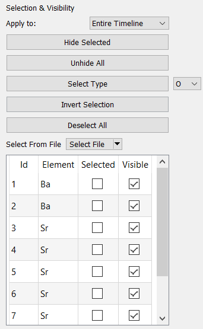
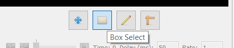
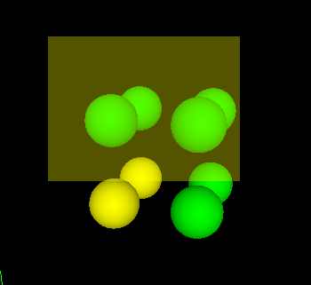
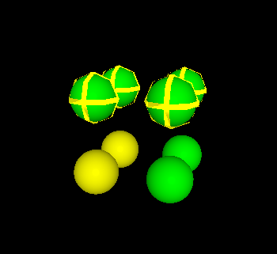
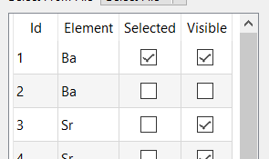
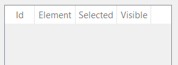
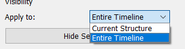

# Selecting and Hiding Atoms

This program includes tools for selecting groups of atoms, as well as 
hiding selected atoms. Atom selections allow you to apply changes to 
only a particular subset of atoms. Additionally, the visibility tools 
allow you to view these groups in isolation, without unintentionally 
modifying the rest of the structure.

---

## Basic Tools

On the left pane, several tools are available for creating selections

| Tool             | Description |
| ---------------- | ----------- |
| Hide Selected    | Hides the currently selected atoms.        |
| Unhide All       | Renders all atoms visible.                 |
| Select Type      | Selects all atoms of some type. Use dropdown to select type. Holding down shift will remove atoms from the selection. |
| Invert Selection | Inverts the selection status of all atoms. |
| Deselect All     | Removes all atoms from the selection.      |

Additionally, atoms can be selected/deselected in the viewport using the 
"Box Select" tool.

Once active, click and drag to select all atoms within a box, or click 
on individual atoms to select them individually. Holding down shift will 
remove atoms from the selection, instead of adding them.

 

---

## Selection List

To manually select or hide/show atoms, an atom list is included below 
the selection tools. Here, you can manually locate an atom by its ID, 
and use the checkboxes to toggle its properties:

---

## Selections In Timeline Mode

When multiple structures are loaded at once 
(see [timeline mode](../../Advanced Use/Timelines/)) selecting atoms 
behaves slightly different.

Firstly, the [selection list](#selection-list) is disabled in timeline 
mode for performance reasons:

Secondly, you will need to choose whether changes to 
selections/visibility affect the entire timeline, or just the current 
structure in the timeline. To switch between these modes, use the 
"Apply To" dropdown:

