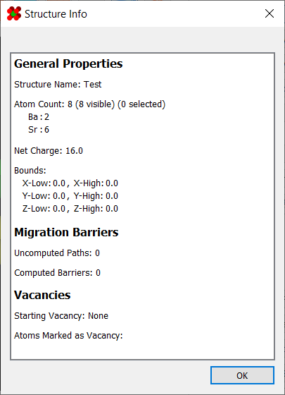
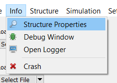
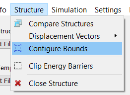

# Structures

This program provides basic tools for viewing and preparing structures for 
use in simulations.

However, it must be noted that this program is not intended for creating 
crystals. As such, you will need to generate crystals using an external 
program such as [Vesta](https://jp-minerals.org/vesta/en/). You will then 
need to export it as an `.xyz` file (or other compatible file) for use here.

---

## Viewing Structure Properties

The structure properties dialog allows you to view basic information about 
the currently opened structure:

It can be accessed under `Info > Structure Properties`:

---

## Bounding Box

The bounding box represents the extent of your structure cell. In the 
viewport, it is visible as a thin, white line:

Besides being viewable in the [properties viewer](#viewing-structure-properties), the bounding box can 
be configured using the "Configure Structure Bounds" dialog.

This dialog has three options for setting the bounding box. Firstly, you 
can set the bounds manually using the line edit fields.

Secondly, the "Tight Fit" button automatically sets the bounds to the 
minimum required to encompass the structure.

Finally, the "Estimate With Periodic Spacing" button attempts to set the 
bounds in a way that preserves the lattice spacing between atoms. This 
usually gets within a few units of the ideal spacing, and is a good 
starting point when setting up for a 
[minimizer](../../Simulations/Minimizing/).

To access this dialog, simply go to `Structure > Configure Bounds`:

Finally, if the source file already contains bounding box information, 
a structure's bounding box will be initialized to that. Reading from an 
`.xyz` file's comment line is also supported, as explained 
[here](../Saving and Opening Files/#structure-files).

---

## Comparing Structures

The program includes support for visually comparing two structures 
with the "Compare Structures" dialog. This dialog contains two minimal 
viewers for comparing two structures.

To use it, simply click the "From Current" button, and the state of the 
current structure in the viewport will be copied over to the 
corresponding window. Alternatively, you can load a structure directly 
from a file with the dropdown.

The dialog can be accessed under `Structure > Compare Structures`:

