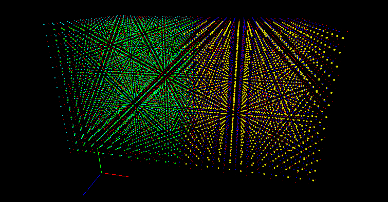
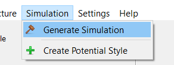
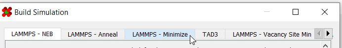
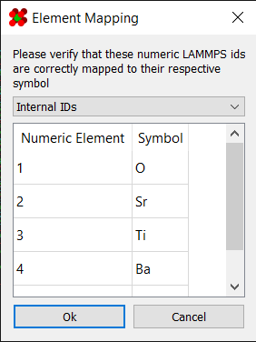
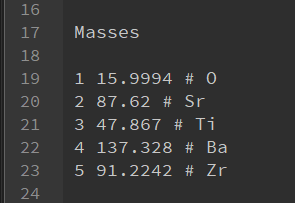
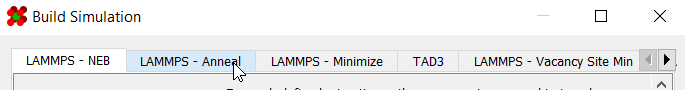

# Annealing From Scratch

This section will guide you through annealing a structure from 
scratch. For this, the basic steps are:

1. [Import Structure](#1-import-structure)
2. [Generate Minimizer](#2-generate-minimizer)
3. [Run the Minimizer](#3-run-the-minimizer)
4. [Generate Annealer](#4-generate-annealer)
5. [Run the Annealer](#5-run-the-annealer)

!!! note
	This program is not designed to *create* structures.  You must
	already have a structure ahead of time!

---

## 1) Import Structure

Load your [structure](../../Basic Use/Saving and Opening Files/#structure-files) into the program:

 

You should now see the structure in the viewport:



---

## 2) Generate Minimizer

Go to `Simulation > Generate Simulation` to launch the 
[simulation generator dialog](../../Simulations/):



Switch to the [minimizer](../../Simulations/Minimizing/) simulation:



Enter parameters for your simulation. An explanation of all the 
fields can be found [here](../../Simulations/Minimizing/). Once 
ready, click "Ok" to generate.

---

## 3) Run the Minimizer

Upload the resulting files to your cluster using the method of 
your choice ([scp](https://linuxize.com/post/how-to-use-scp-command-to-securely-transfer-files/), 
[FileZilla](https://filezilla-project.org/), etc.)

To run the simulation, navigate to the directory containing your 
simulation files and run the command:

```shell
sbatch slurm-mpi-main.sh
```

The minimizer may require some time to run. Once it's finished, you 
can retrieve the resulting structure from `/logs/[NAME]-min.dat`

---

## 4) Generate Annealer

First, load the newly minimized structure back into the program. 
Since you're loading a LAMMPS `.dat` file, the program may prompt 
you to match the numeric IDs in the file with their symbols:



If you do not know which IDs correspond to which element, locate 
the `[NAME].dat` structure file in the `Assets` folder of the 
minimizer. The Masses section should list the element with a 
comment:



Next, go to `Simulation > Generate Simulation` to launch the 
simulation generator dialog as before:


Switch to the annealer simulation:



Enter parameters for your simulation. An explanation of all the 
fields can be found [here](../../Simulations/Annealing). Once ready, 
click "Ok" to generate.
 
---
 
## 5) Run the Annealer
 
Upload the resulting files to your cluster using the method of your 
choice ([scp](https://linuxize.com/post/how-to-use-scp-command-to-securely-transfer-files/), 
[FileZilla](https://filezilla-project.org/), etc.)

To run the simulation, navigate to the directory containing your 
simulation files and run the command:

```shell
sbatch slurm-mpi-main.sh
```

The annealer may require some time to run. Once it's finished, you 
can retrieve the resulting structure from `/logs/[NAME]-anneal.dat`
