# Generating NEB Simulations

This section will guide you setting up, running, and viewing the 
results of an NEB simulation. For this, the basic steps are:

1. [Import Structure](#1-import-structure)
2. [Prepare Structure](#2-prepare-structure)
3. [Generate Migration Paths](#3-generate-migration-paths)
4. [Generate NEB Simulations](#4-generate-neb-simulations)
5. [Run the NEB Simulations](#5-run-the-neb-simulations)
6. [Viewing Computed Barriers](#6-viewing-computed-barriers)

<table align=center class="warning" width=75% style="border: 2px solid #E05757; background-color: #FFE0E0;">
	<tr><td>
		Depending on what you set the "division count" to 
		(see <a href="../../Simulations/NEB/#neb-options">here</a>), this 
		may schedule a <i>lot</i> of jobs (one per division)!  Make sure you are 
		allowed to schedule that many jobs!
	</td></tr>
</table><br />
<table align=center class="info" width=75% style="border: 2px solid #5757E0; background-color: #E0E0FF;">
	<tr><td>
		<span style="font-weight: bold;">Note:</span> this is designed for running on clusters that use the
		<a href="https://slurm.schedmd.com/">slurm</a> job scheduler, and have 
		<a href="https://www.lammps.org/">LAMMPS</a> installed.
	</td></tr>
</table><br />
<table align=center class="info" width=75% style="border: 2px solid #5757E0; background-color: #E0E0FF;">
	<tr><td>
		<span style="font-weight: bold;">Note:</span> by this point, you should already have an annealed structure.  More
		information on annealing structure can be found <a href="../Annealing From Scratch/">here</a>.
	</td></tr>
</table><br />

---

## 1) Import Structure

Load your [structure](../../Basic Use/Saving and Opening Files/#structure-files) into the program:

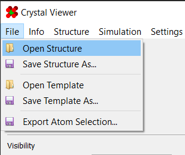 

You should now see the structure in the viewport:

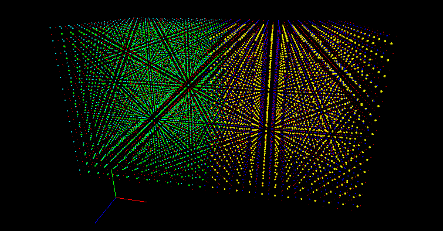

---

## 2) Prepare Structure

It is <span style="color: red;">required</span> to define a 
[starting vacancy](../../Basic Use/Modifying Atoms/#mark-as-starting-vacancy). 
To do so, use the "Mark as Starting Vacancy" tool found in the "Modify" section:

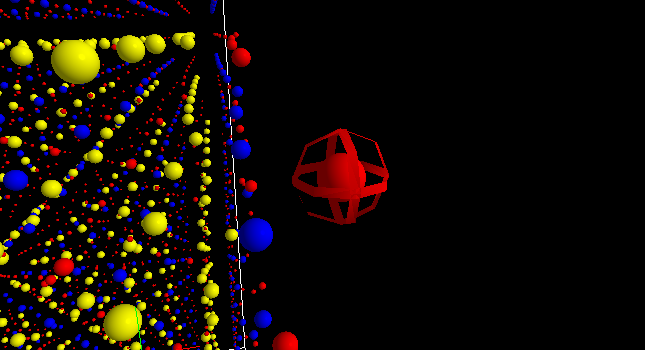

Additionally, you may wish to mark other atoms as 
[vacancies](../../Basic Use/Modifying Atoms/#mark-as-vacancy), or 
[dope atoms](../../Basic Use/Modifying Atoms/#doping-atoms):

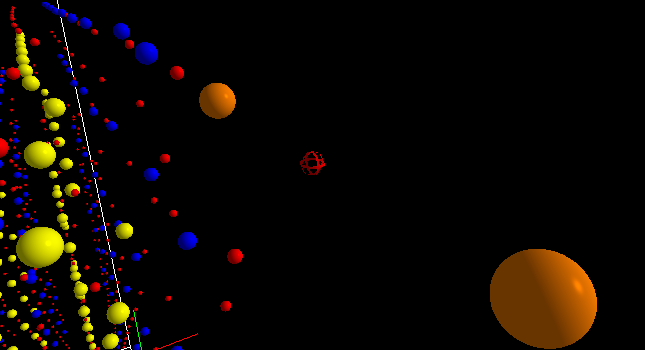

As always, more information on these tools can be found in their 
respective sections.

---

## 3) Generate Migration Paths

Go to the "[Migration Paths](../../Advanced Use/Migration Paths/)" 
panel on the right side:

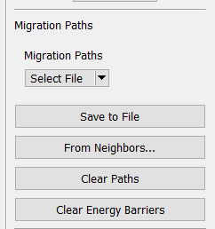

Here, you can either [load the migration paths from a file](../../Basic Use/Saving and Opening Files/#migration-paths), 
or you can generate new ones using a proximity-based system. To 
generate new ones, click on "From Neighbors..." to launch the 
"Paths From Neighbors" dialog:

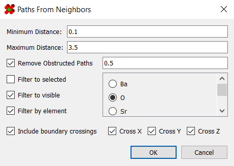

Enter the parameters that best fit your case. Additionally, several 
filters are available to determine which paths should be generated. 
A description of the fields can be found [here](../../Advanced Use/Migration Paths/#generating-paths).

Note that for large structures, it may take a few moments to 
generate the paths, especially if "Remove Obstructed Paths" is 
enabled. Once generated, they will, be present as white arrows in 
the viewport:

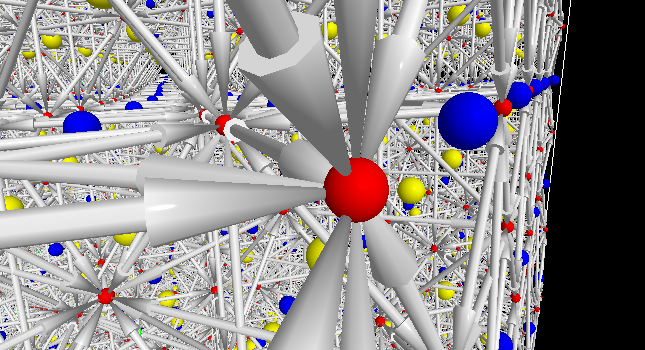

## 4) Generate NEB Simulations

Go to `Simulation > Generate Simulation` to launch the simulation 
generator dialog:


Switch to the [NEB](../../Simulations/NEB/) simulation:

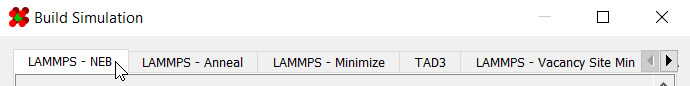

Enter parameters for your simulation. An explanation of all the 
fields can be found [here](../../Simulations/NEB/). Once ready, 
click "Ok" to generate.

---

## 5) Run the NEB Simulations

Upload the resulting files to your cluster using the method of 
your choice ([scp](https://linuxize.com/post/how-to-use-scp-command-to-securely-transfer-files/), 
[FileZilla](https://filezilla-project.org/), etc.)

To run the simulation, navigate to the directory containing your 
simulation files and run the command:

```shell
sbatch slurm-mpi-main.sh
```

This will run the master job scheduling script. It will first run a 
pre-minimizer job if it detects one hasn't been run already. If it 
detects the pre-minimizer *has* been run (meaning you've run this 
script before), this step will be skipped. Generally, you will not 
need to worry about this preparation step.

The master job script will then schedule each 
[division](../../Simulations/NEB/#neb-options) as a separate job. 
These jobs will first wait for the pre-minimizer to finish before 
running themselves.

Depending on how many paths you're simulating, it may take some 
time for them to complete. Once finished, a final compilation 
script will run automatically, compiling the 
[energy barriers](../../Basic Use/Saving and Opening Files/#energy-barriers) 
into a single table found in 
`/Compiled Energy Barriers/[NAME] Barriers.csv`.

Finally, any paths that failed to run—whether due to convergence 
issues or the cluster having a bad day—will be logged to 
`/Missing Barriers/Missing.csv`. This can be loaded back into the 
viewer as ordinary [migration paths](../../Basic Use/Saving and Opening Files/#migration-paths).

## 6) Viewing Computed Barriers

Once all jobs have finished, download the completed 
[barriers file](../../Basic Use/Saving and Opening Files/#energy-barriers) 
from `/Compiled Energy Barriers/[NAME] Barriers.csv`.

Then, load your structure back in. For convenience, a template file 
(named `template.gz`) was automatically added to the simulation 
directory upon initial generation. That way, you can restore the 
complete initial setup for reference.

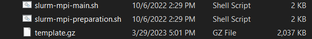

Next, load the [energy barriers](../../Basic Use/Saving and Opening Files/#energy-barriers) 
into the viewer using the "Migration Paths" panel.


Now that your barriers are loaded in, it's possible that some of 
them didn't converge properly. This could skew the energy scale 
into entirely unreasonable territory:

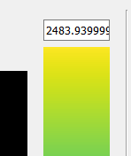

Fortunately, you can use the newly visible energy scale bar to adjust the limits of the range:

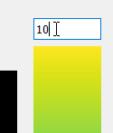

Additionally, you can toggle "Clip Energy Barriers" to hide any 
barrier outside the energy range. This is found under 
`Structure > Clip Energy Barriers`:

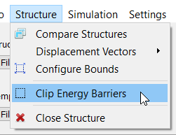
