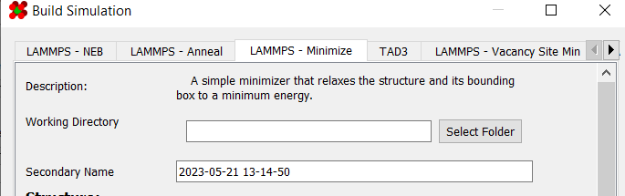
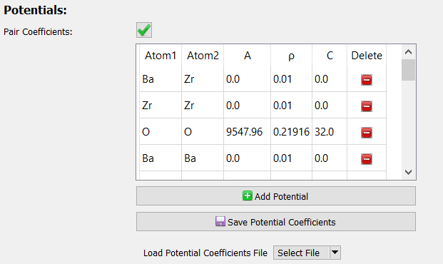
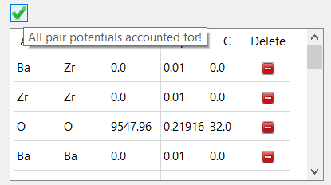
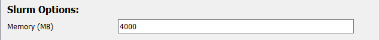
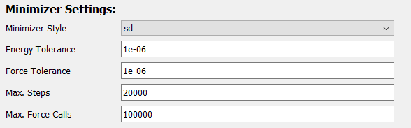

# Minimizing

A "minimizer" simulation relaxes a structure until its atoms are in 
a minimum energy position. This is useful to obtain a more realistic 
structure given some starting conditions. Additionally, this 
simulator will adjust the bounding box to achieve minimum energy.

It is accessible in the **"LAMMPS - Minimize"** tab of the 
[simulation generator dialog](../):

---

## Requirements

In order to build a minimizer simulation, a structure with a non-zero 
[bounding box](../../Basic Use/Structures/#bounding-box) must 
already be set up in the viewer:

---

## General Options

The first set of options involve basic information about the 
simulation and structure:

| Field             | Description |
| ----------------- | ----------- |
| Working Directory | Location to generate the files to |
| Secondary Name    | Name of simulation. This will decide the name of the output directory |
| Structure Name    | Name of structure. Used in deciding file names of simulation outputs |
| Mass Table        | Atomic masses to use in the simulation. Defaults to the masses defined in the [atom styles](../../Appearance/Atom Properties/) table |
| Bounding Box      | Bounding box of the structure. Defaults to the bounding box already defined for the structure |

---

## Potentials Options

The next set of options controls the potential coefficients and 
potential style used in the simulation.

| Field             | Description                              |
| ----------------- | ---------------------------------------- |
| [Pair Coefficients](../../Advanced Use/Saving Potential Coefficients/) | Coefficients used in the pair potentials |
| [Potential Style](../../Advanced Use/Adding Potentials)                | Style to use for the potential           |

In order for a simulation to be considered valid, you must have enough potentials for all elements:

 

For convenience, both potential coefficients and styles can be 
saved and loaded. More information on saving/loading potential 
coefficients can be found 
[here](../../Advanced Use/Saving Potential Coefficients/). 
Additionally, more information on saving/loading/creating potential 
styles can be found [here](../../Advanced Use/Adding Potentials).

---

## Slurm Options

The next set of options controls some variables used by slurm.

| Field  | Description                                         |
| ------ | --------------------------------------------------- |
| Memory | Amount of memory, in megabytes, to allocate per job |

---

## LAMMPS Options

The next set of options are those specific to LAMMPS:

| Field           | Description |
| --------------- | ----------- |
| LAMMPS Version  | LAMMPS module name for slurm to load |
| KSpace Solver   | Name of long-range force solver for LAMMPS to use. For more information on kspace styles, see [here](https://docs.lammps.org/kspace_style.html) |
| KSpace Accuracy | Accuracy of kspace solver |
| Timestep        | Timestep used in simulations. Measured in picoseconds by default |
| Unit System     | Unit system used by LAMMPS. For more information on LAMMPS unit systems, see [here](https://docs.lammps.org/units.html). Note: unit systems besides metal have not been tested, use at your own risk!

---

## Minimizer Options

The final set of options controls the minimizer:

| Field            | Description |
| ---------------- | ----------- |
| Minimizer Style  | Method to use for minimizing. More information on minimizer styles can be found [here](https://docs.lammps.org/min_style.html) |
| Energy Tolerance | Minimizer terminates when the ratio between the energy change and energy magnitude is less than this value. Set to 0.0 to disable |
| Force Tolerance  | Stopping tolerance for length of global force vector. Set to 0.0 to disable |
| Max. Steps       | Maximum number of steps to run the minimizer |
| Max. Force Calls | Maximum number of force evaluations before terminating the minimizer |

More information on the LAMMPS minimizer can be found [here](https://docs.lammps.org/minimize.html).

