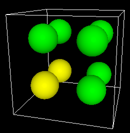
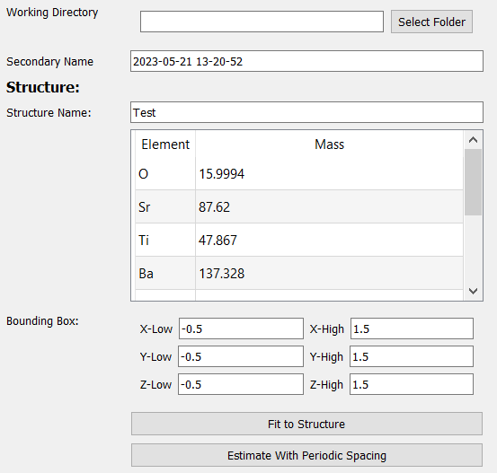
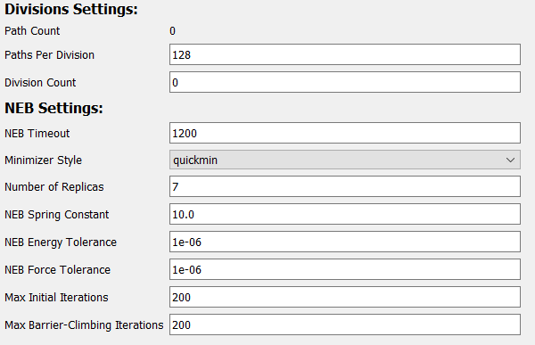

# Nudged Elastic Band (NEB)

The nudged elastic band (NEB) method is a computational technique 
used to study the transition states between different states of a 
system. It finds the minimum energy pathway by optimizing a chain of 
intermediate configurations, resembling a stretched elastic band, 
connecting the initial and final states. More information on the 
NEB method is available [here](https://docs.lammps.org/neb.html).

It is accessible in the **"LAMMPS - NEB"** tab of the 
[simulation generator dialog](../):

---

## Requirements

In order to build an NEB simulation, a structure with a non-zero 
[bounding box](../../Basic Use/Structures/#bounding-box) must 
already be set up in the viewer:

Besides that, a [starting vacancy](../../Basic Use/Modifying Atoms/#mark-as-starting-vacancy) 
must be defined. Additional [vacancies](../../Basic Use/Modifying Atoms/#mark-as-vacancy) 
are optional.

Finally, [migration paths](../../Advanced Use/Migration Paths/) must be defined for the NEB to know what paths to calculate.

---

## General Options

The first set of options involve basic information about the 
simulation and structure:

| Field             | Description |
| ----------------- | ----------- |
| Working Directory | Location to generate the files to |
| Secondary Name    | Name of simulation. This will decide the name of the output directory |
| Structure Name    | Name of structure. Used in deciding file names of simulation outputs |
| Mass Table        | Atomic masses to use in the simulation. Defaults to the masses defined in the [atom styles](../../Appearance/Atom Properties/) table |
| Bounding Box      | Bounding box of the structure. Defaults to the bounding box already defined for the structure |

---

## Potentials Options

The next set of options controls the potential coefficients and 
potential style used in the simulation.

| Field             | Description                              |
| ----------------- | ---------------------------------------- |
| [Pair Coefficients](../../Advanced Use/Saving Potential Coefficients/) | Coefficients used in the pair potentials |
| [Potential Style](../../Advanced Use/Adding Potentials)                | Style to use for the potential           |

In order for a simulation to be considered valid, you must have enough potentials for all elements:

 

For convenience, both potential coefficients and styles can be 
saved and loaded. More information on saving/loading potential 
coefficients can be found 
[here](../../Advanced Use/Saving Potential Coefficients/). 
Additionally, more information on saving/loading/creating potential 
styles can be found [here](../../Advanced Use/Adding Potentials).

---

## Slurm Options

The next set of options controls some variables used by slurm.

| Field  | Description                                         |
| ------ | --------------------------------------------------- |
| Memory | Amount of memory, in megabytes, to allocate per job |

---

## NEB Options

The final set of options configures the NEB process:

To achieve a high throughput, the simulator runs many NEB 
simulations in parallel using slurm's job scheduler. Essentially, 
simulations are divided up into "divisions," within which several 
simulations are run in series. Then, each division is scheduled as 
a separate job using slurm.

| Field              | Description                               |
| ------------------ | ----------------------------------------- |
| Paths Per Division | Number of paths to place in each division |
| Division Count     | Total number of divisions to create       |

The remaining options directly configure the NEB process:

| Field                            | Description                               |
| -------------------------------- | ----------------------------------------- |
| NEB Timeout                      | Maximum time, in seconds, to run an individual NEB before terminating.  Useful for preventing non-converging simulations from hogging compute time |
| Minimizer Style                  | Minimizer style to use in the NEB's minimization process |
| Number of Replicas               | Number of intermediate configurations (including the start and end). Note: increasing this will drastically increase the memory requirements |
| NEB Spring Constant              | Spring constant used in the "elastic band" |
| NEB Energy Tolerance             | Stopping tolerance for energy in the NEB's minimization process |
| NEB Force Tolerance              | Stopping tolerance for force in the NEB's minimization process |
| Max. Initial Iterations          | Maximum number of iterations to run the initial NEB process that find the minimum-energy path |
| Max. Barrier-Climbing Iterations | After the minimum energy path is found, maximum number of iterations to run the NEB that finds the peak of the energy barrier |
