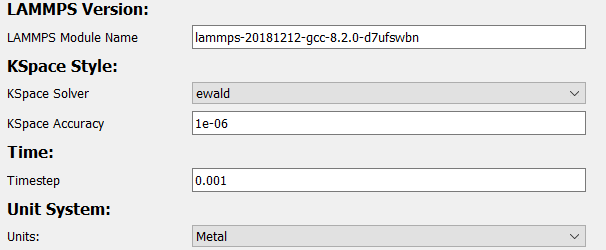

# Parallel Replica Dynamics (PRD)

Parallel replica dynamics (PRD) is a type of simulation used for 
performing accelerated dynamics on a system where events are 
infrequent.

Starting with an initial configuration, it creates multiple copies 
across several processors and randomizes their velocities. While each 
copy is simulated in parallel, the PRD periodically checks for jump 
"events." If one is found, an [NEB](../NEB/) simulation is performed 
to find the minimum energy path of this jump. Then, all simulations 
sync to the endpoint of that jump, and the process is repeated.

The advantage of this method is that it can run multiple searches 
for statistically significant "events" simultaneously.

It is accessible in the **"LAMMPS - PRD"** tab of the 
[simulation generator dialog](../):

For more information on parallel replica dynamics, see 
[here](https://docs.lammps.org/prd.html), or 
Voter, Phys Rev B, 57, 13985 (1998).

---

## Requirements

In order to build a PRD simulation, a structure with a non-zero 
[bounding box](../../Basic Use/Structures/#bounding-box) must 
already be set up in the viewer:

Optionally, any atom marked as a 
[vacancy](../../Basic Use/Modifying Atoms/#mark-as-vacancy) 
(including [starting vacancies](../../Basic Use/Modifying Atoms/#mark-as-starting-vacancy)) 
will be deleted at runtime.

---

## General Options

The first set of options involve basic information about the 
simulation and structure:

| Field             | Description |
| ----------------- | ----------- |
| Working Directory | Location to generate the files to |
| Secondary Name    | Name of simulation. This will decide the name of the output directory |
| Structure Name    | Name of structure. Used in deciding file names of simulation outputs |
| Mass Table        | Atomic masses to use in the simulation. Defaults to the masses defined in the [atom styles](../../Appearance/Atom Properties/) table |
| Bounding Box      | Bounding box of the structure. Defaults to the bounding box already defined for the structure |

---

## Potentials Options

The next set of options controls the potential coefficients and 
potential style used in the simulation.

| Field             | Description                              |
| ----------------- | ---------------------------------------- |
| [Pair Coefficients](../../Advanced Use/Saving Potential Coefficients/) | Coefficients used in the pair potentials |
| [Potential Style](../../Advanced Use/Adding Potentials)                | Style to use for the potential           |

In order for a simulation to be considered valid, you must have enough potentials for all elements:

 

For convenience, both potential coefficients and styles can be 
saved and loaded. More information on saving/loading potential 
coefficients can be found 
[here](../../Advanced Use/Saving Potential Coefficients/). 
Additionally, more information on saving/loading/creating potential 
styles can be found [here](../../Advanced Use/Adding Potentials).

---

## Slurm Options

The next set of options controls some variables used by slurm.

| Field  | Description                                         |
| ------ | --------------------------------------------------- |
| Memory | Amount of memory, in megabytes, to allocate per job |

---

## LAMMPS Options

The next set of options are those specific to LAMMPS:

| Field           | Description |
| --------------- | ----------- |
| LAMMPS Version  | LAMMPS module name for slurm to load |
| KSpace Solver   | Name of long-range force solver for LAMMPS to use. For more information on kspace styles, see [here](https://docs.lammps.org/kspace_style.html) |
| KSpace Accuracy | Accuracy of kspace solver |
| Timestep        | Timestep used in simulations. Measured in picoseconds by default |
| Unit System     | Unit system used by LAMMPS. For more information on LAMMPS unit systems, see [here](https://docs.lammps.org/units.html). Note: unit systems besides metal have not been tested, use at your own risk!

---

## PRD Options

The final set of options configures the PRD process. For a more 
complete explanation of how these parameters effect the 
simulation, it is recommended you see 
[here](https://docs.lammps.org/prd.html).

The following settings are used in the PRD's quenching stage:

| Field            | Description |
| ---------------- | ----------- |
| Energy Tolerance | Stopping tolerance for energy in the PRD's minimizer   |
| Force Tolerance  | Stopping tolerance for force in the PRD's minimizer    |
| Max. Steps       | Maximum number of steps to run the quenching stage for |
| Max. Force Calls | Maximum number of times to evaluate the forces during the quenching stage before terminating |

The remaining options control how the PRD detects and handles jump 
events:

| Field               | Description                                                                 |
| ------------------- | --------------------------------------------------------------------------- |
| Event Distance      | Distance an atom must move for a jump event to be detected                  |
| Temperature         | Temperature, in kelvin, to run the simulation at                            |
| Event Region        | A jump event must occur within the specified region in order to be detected |
| Number of Timesteps | Number of timesteps to run the PRD for                                      |
| T-Event             | Timestep interval between checking for events                               |
| N-Dephase           | Number of velocity randomizations performed during each dephasing stage     |
| T-Dephase           | Number of timesteps to run molecular dynamics during the dephasing stage    |
| T-Correlate         | Number of timesteps within which two events are considered correlated       |

