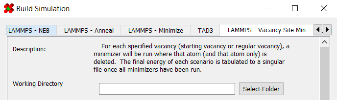
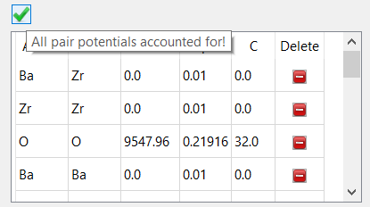
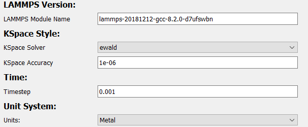
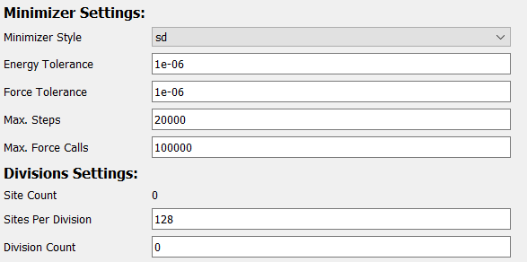

# Vacancy Site Minimizer

The "vacancy site minimizer" computes the energy associated with 
creating vacancies at various positions throughout a structure.

It is accessible in the **"LAMMPS - Vacancy Site Min"** tab of the 
[simulation generator dialog](../):

---

## Requirements

In order to build a minimizer simulation, a structure with a non-zero 
[bounding box](../../Basic Use/Structures/#bounding-box) must 
already be set up in the viewer:

Additionally, the sites that are to be computed must be marked as 
[vacancies](../../Basic Use/Modifying Atoms/#mark-as-vacancy). 
Here, the [starting vacancies](../../Basic Use/Modifying Atoms/#mark-as-vacancy) 
is treated as a regular vacancy.

Note that only one vacancy is created at a time per simulation (see [below](#site-minimizer-options)).

---

## General Options

The first set of options involve basic information about the 
simulation and structure:

| Field             | Description |
| ----------------- | ----------- |
| Working Directory | Location to generate the files to |
| Secondary Name    | Name of simulation. This will decide the name of the output directory |
| Structure Name    | Name of structure. Used in deciding file names of simulation outputs |
| Mass Table        | Atomic masses to use in the simulation. Defaults to the masses defined in the [atom styles](../../Appearance/Atom Properties/) table |
| Bounding Box      | Bounding box of the structure. Defaults to the bounding box already defined for the structure |

---

## Potentials Options

The next set of options controls the potential coefficients and 
potential style used in the simulation.

| Field             | Description                              |
| ----------------- | ---------------------------------------- |
| [Pair Coefficients](../../Advanced Use/Saving Potential Coefficients/) | Coefficients used in the pair potentials |
| [Potential Style](../../Advanced Use/Adding Potentials)                | Style to use for the potential           |

In order for a simulation to be considered valid, you must have enough potentials for all elements:

 

For convenience, both potential coefficients and styles can be 
saved and loaded. More information on saving/loading potential 
coefficients can be found 
[here](../../Advanced Use/Saving Potential Coefficients/). 
Additionally, more information on saving/loading/creating potential 
styles can be found [here](../../Advanced Use/Adding Potentials).

---

## Slurm Options

The next set of options controls some variables used by slurm.

| Field  | Description                                         |
| ------ | --------------------------------------------------- |
| Memory | Amount of memory, in megabytes, to allocate per job |

---

## LAMMPS Options

The next set of options are those specific to LAMMPS:

| Field           | Description |
| --------------- | ----------- |
| LAMMPS Version  | LAMMPS module name for slurm to load |
| KSpace Solver   | Name of long-range force solver for LAMMPS to use. For more information on kspace styles, see [here](https://docs.lammps.org/kspace_style.html) |
| KSpace Accuracy | Accuracy of kspace solver |
| Timestep        | Timestep used in simulations. Measured in picoseconds by default |
| Unit System     | Unit system used by LAMMPS. For more information on LAMMPS unit systems, see [here](https://docs.lammps.org/units.html). Note: unit systems besides metal have not been tested, use at your own risk!

---

## Site Minimizer Options

The final set of options configures the site minimizer itself:

To achieve a high throughput, the simulator runs many simulations 
in parallel using slurm's job scheduler. Essentially, simulations 
are divided up into "divisions," within which several simulations 
are run in series. Then, each division is scheduled as a separate 
job using slurm.

| Field              | Description                                  |
| ------------------ | -------------------------------------------- |
| Sites Per Division | Number of sites to simulate in each division |
| Division Count     | Total number of divisions to create          |

The remaining options configure the minimizer. These are identical 
to the settings used in the regular [minimizer](../Minimizing/):

| Field             | Description |
| ----------------- | ----------- |
| Minimizer Style   | Method to use for minimizing. More information on minimizer styles can be found [here](https://docs.lammps.org/min_style.html) |
| Energy Tolerance  | Minimizer terminates when the ratio between the energy change and energy magnitude is less than this value. Set to 0.0 to disable |
| Force Tolerance   | Stopping tolerance for length of global force vector. Set to 0.0 to disable |
| Max. Steps        | Maximum number of steps to run the minimizer |
| Max. Force Calls  | Maximum number of force evaluations before terminating the minimizer |
| Minimizer Timeout | Maximum time, in seconds, to run an individual NEB before terminating.  Useful for preventing non-converging simulations from hogging compute time |
