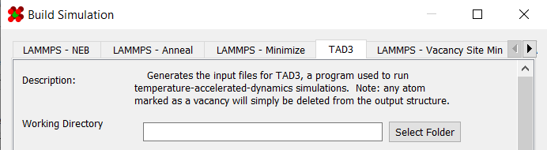
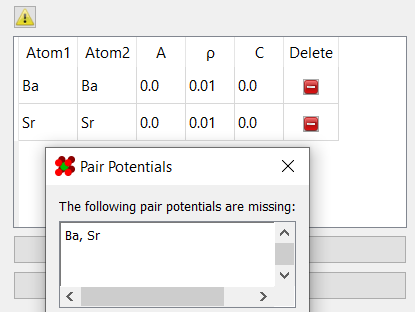
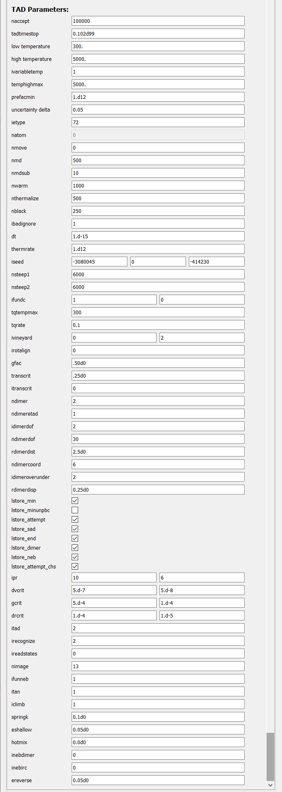

# Temperature Accelerated Dynamics (TAD)

Temperature accelerated dynamics (TAD) is a method that runs a 
simulation at a higher temperature to generate results for a 
lower temperature. The higher temperature allows for jumps to be 
sampled far faster than if the simulation were run at the lower 
temperature.

It is accessible in the **"LAMMPS - TAD3"** tab of the 
[simulation generator dialog](../):

!!! danger "Note:"
	This simulation does *not* use LAMMPS or slurm.  Instead, it
	requires the TAD3 simulator to be compiled and installed on your machine. 
	A fork of it is available [here](https://github.com/lanl/spectad).

---

## Requirements

In order to build a TAD simulation, a structure with a non-zero 
[bounding box](../../Basic Use/Structures/#bounding-box) must 
already be set up in the viewer:

Additionally, any atom marked as a [vacancy](../../Basic Use/Modifying Atoms/#mark-as-vacancy) 
(including [starting vacancies](../../Basic Use/Modifying Atoms/#mark-as-starting-vacancy)) 
will be deleted upon generation.

---

## General Options

The first set of options involve basic information about the 
simulation and structure:

| Field             | Description |
| ----------------- | ----------- |
| Working Directory | Location to generate the files to |
| Secondary Name    | Name of simulation. This will decide the name of the output directory |
| Structure Name    | Name of structure. Used in deciding file names of simulation outputs |
| Mass Table        | Atomic masses to use in the simulation. Defaults to the masses defined in the [atom styles](../../Appearance/Atom Properties/) table |
| Bounding Box      | Bounding box of the structure. Defaults to the bounding box already defined for the structure |

---

## Potentials Options

The next set of options controls the potential coefficients and 
potential style used in the simulation.

| Field             | Description                              |
| ----------------- | ---------------------------------------- |
| [Pair Coefficients](../../Advanced Use/Saving Potential Coefficients/) | Coefficients used in the pair potentials |

In order for a simulation to be considered valid, you must have enough potentials for all elements:

 

For convenience, both potential coefficients and styles can be 
saved and loaded. More information on saving/loading potential 
coefficients can be found 
[here](../../Advanced Use/Saving Potential Coefficients/). 
The program does *not* support other potential styles for TAD3 at 
this time.

---

## TAD Options

A legion of options are available for configuring *TAD3*. However, 
it is beyond the scope of this documentation to fully describe the 
features of TAD3. That said, hovering over any of the options in 
the simulation builder dialog will display a tooltip briefly 
describing its purpose.

