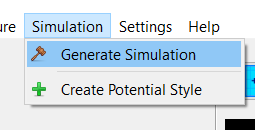
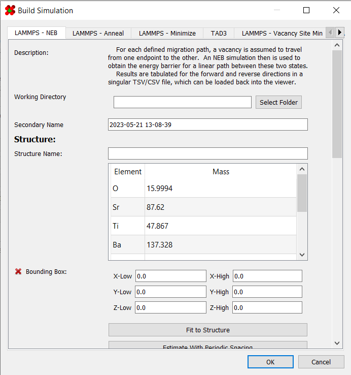

# Simulations

One of the primary features of the program is the ability to 
rapidly set up and generate simulations. Aside from [TAD3](TAD3/), 
these simulators are designed for [LAMMPS](https://www.lammps.org/), 
with the [slurm](https://slurm.schedmd.com/) workload manager to 
schedule jobs.

To access the simulation generator dialog, go to 
`Simulations > Generate Simulation`:

Here, you will be met with a dialog containing options for various 
built-in simulations:

In this dialog, the following simulators are offered:

* [Structure Minimizer](Minimizing/)
* [Annealer](Annealing/)
* [Nudged Elastic Band (NEB)](NEB/)
* [Parallel Replica Dynamics (PRD)](PRD/)
* [Temperature Accelerated Dynamics (TAD)](TAD3/)
* [Site Vacancy Minimizer](Site Minimizer/)
