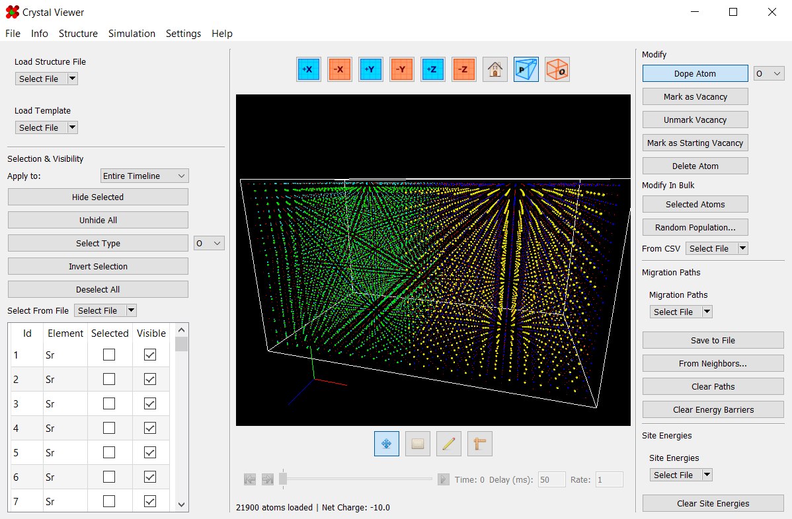

# Introduction

Crystal Viewer is program developed to assist with generating many, many NEB simulations.  
It contains tools for setting up migration paths between atoms, generating the files needed 
for the NEB simulations, and viewing the results of said simulations.

---

## Contents

* [Basic Use](Basic Use/)
	* [Saving and Opening Files](Basic Use/Saving and Opening Files/)
	* [Navigation](Basic Use/Navigation/)
	* [Selecting and Hiding Atoms](Basic Use/Selecting and Hiding Atoms/)
	* [Structures](Basic Use/Structures/)
	* [Modifying Atoms](Basic Use/Modifying Atoms/)
* [Advanced Use](Advanced Use/)
	* [Migration Paths](Advanced Use/Migration Paths/)
	* [Site Energies](Advanced Use/Site Energies/)
	* [Timelines](Advanced Use/Timelines/)
	* [Displacement Vectors](Advanced Use/Displacement Vectors/)
	* [Saving Potential Coefficients](Advanced Use/Saving Potential Coefficients/)
	* [Adding Potentials](Advanced Use/Adding Potentials/)
* [Appearance](Appearance/)
	* [Atom Properties](Appearance/Atom Properties/)
	* [Rendering](Appearance/Rendering/)
	* [Stylesheets](Appearance/Stylesheets/)
* [Simulations](Simulations/)
	* [Structure Minimizer](Simulations/Minimizing/)
	* [Annealer](Simulations/Annealing/)
	* [Nudged Elastic Band (NEB)](Simulations/NEB/)
	* [Parallel Replica Dynamics (PRD)](Simulations/PRD/)
	* [Temperature Accelerated Dynamics (TAD)](Simulations/TAD3/)
	* [Site Vacancy Minimizer](Simulations/Site Minimizer/)
* [Guides](Guides/)
	* [Annealing From Scratch](Guides/Annealing From Scratch/)
	* [Generating NEB Simulations](Guides/Generate NEB Simulations/)

---

## Credits

Documentation built using mkdocs (see [mkdocs.org](https://www.mkdocs.org)).

This project uses icons from the Fugue Icon set by Yusuke Kamiyamane (see [p.yusukekamiyamane.com](https://p.yusukekamiyamane.com/)).
